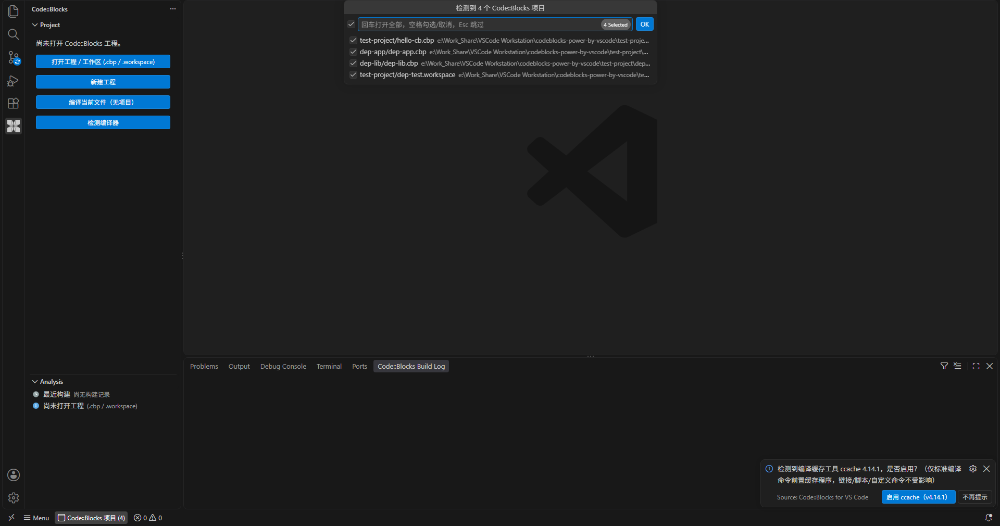
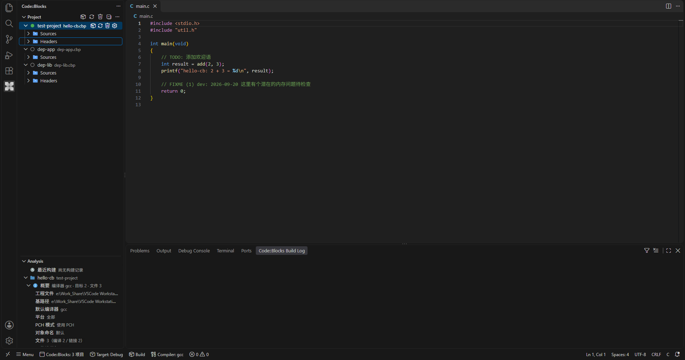
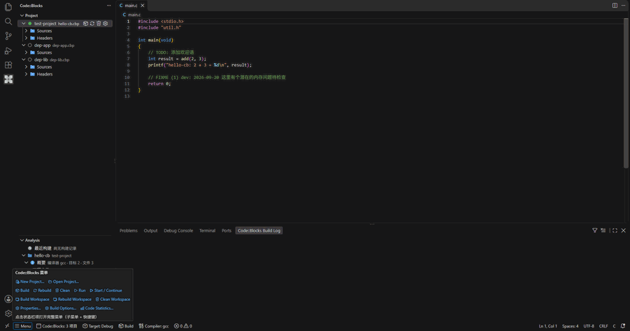
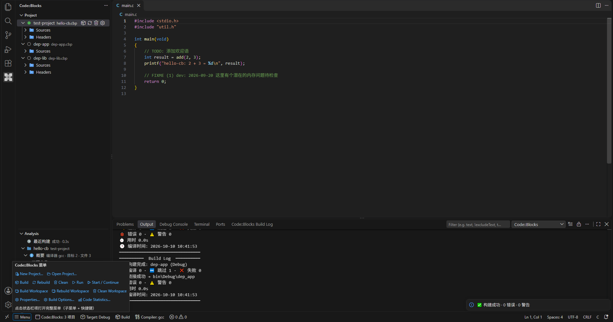
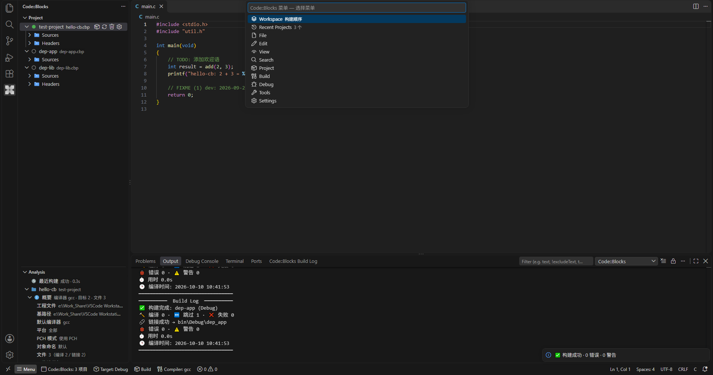
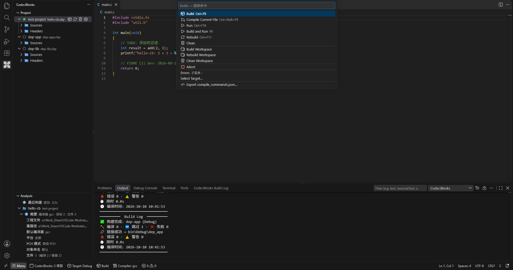

# Code::Blocks for VS Code

原生移植 Code::Blocks 核心功能到 VS Code 的扩展 —— 一个直接驱动 GCC/GDB 的「迷你 IDE 内核」，**不是** `.cbp` → `tasks.json` 的桥接。

直接在 VS Code 中打开 `.cbp` / `.workspace` 工程，即可获得与 Code::Blocks 对齐的构建、调试与工程浏览体验。

> **作者**：Robinmaomao ｜ **版本**：0.8.128

[](LICENSE.md)

> **许可证说明**：本扩展的 TypeScript 代码为独立重写（非复制 GPL 源码）；其中错误正则表（`resources/compilers/options_common_re.xml`）与命令模板（`resources/compilers/options_gcc.xml`）源自 GPL v3 的 Code::Blocks `compilergcc` 资源，因此整体按 GPL v3 发布，详见 [LICENSE.md](LICENSE.md)。

> 📖 详细的功能介绍、使用说明与 **RISC-V 交叉编译完整示例**见 [docs/使用说明.md](docs/使用说明.md)；逐项对齐依据见 [docs/对齐对照.md](docs/对齐对照.md)。

> **非官方声明**：本扩展是社区个人开发者基于公开资料对 Code::Blocks 功能的**独立重写与移植**，与 Code::Blocks 官方项目及其作者 / 团队**无任何隶属、合作或背书关系**，也不代表其立场；「Code::Blocks」名称与标识版权归其原作者所有，此处仅用于说明所对标的功能与兼容目标。问题反馈请提交到 [本仓库 Issues](https://github.com/robinmaomao/vscode-codeblocks-emu/issues)，**不要**提交给 Code::Blocks 官方。
>
> **Disclaimer (unofficial)**：This is an unofficial, community-developed re-implementation of Code::Blocks features for VS Code. It is **not affiliated with, endorsed by, or sponsored by** the Code::Blocks project or its authors. "Code::Blocks" is used solely to describe the feature set it is modelled after. Please report issues to [this repository](https://github.com/robinmaomao/vscode-codeblocks-emu/issues), **not** to the Code::Blocks team.

## 截图

> 以下截图均由本扩展在真实 VS Code 中运行录制（示例工程即仓库内的 [`test-project/`](test-project/)：3 个 `.cbp` + 1 个 `.workspace`）。

### 打开工作区：自动检测并多选打开 `.cbp` / `.workspace`



### 工程树 · 项目管理 · 工程分析



### 构建：状态栏菜单 → Build Workspace → 实时构建日志





### Code::Blocks 菜单（状态栏 `Menu`：9 大顶级菜单 + 快捷键）





## 特性

### 工程与构建

- 📁 **原生工程解析**：直接加载 `.cbp` / `.workspace`（`fast-xml-parser`），完整还原 `Project` / `BuildTarget` / `ProjectFile` 内存模型，支持虚拟目标与虚拟文件夹。
- 🔨 **真实构建引擎**：不依赖 `tasks.json`。内置 Code::Blocks 的命令模板 + 宏展开（`$compiler $options $includes ...`），直接 `spawn` 编译/链接进程；增量编译（源文件 + `#include` 头文件 + 链接输入 mtime 比对）。
- ⚙️ **编译器管理**：完整解析 `options_<id>.xml`（含 `extends` 继承、`<if platform>` 平台分支、`<Common>` 引用）；自动探测 GCC / MinGW / Clang / MSVC / RISC-V，以及 AVR / MSP430 / SDCC 工具链；支持从 Code::Blocks 的 `default.conf` 读取**用户自定义交叉编译器**。
- 🗂️ **多项目管理**：同时打开多个 `.cbp`，工程树支持拖拽排序（即编译顺序）、上移/下移、移除项目、活动项目高亮；打开工作区自动检测 `.cbp`，多选弹窗（目录名/文件名、默认全选）或状态栏入口随时重新打开。
- 📂 **工程树浏览**：按公共顶层目录（`relativeToCommonTopLevelPath`）展开的多层嵌套目录树、文件类型图标、缺失文件标记、目录优先排序（对齐 VS Code Explorer）。
- 🧩 **右键菜单**：项目节点支持增量编译/全量编译/添加文件；文件节点支持从项目移除、打开所在目录、切换编译/链接开关（写回 `.cbp`）。
- 📄 **单文件编译 / 单文件 Clean**：工程树右键文件 → `Build File`（对齐 Code::Blocks `CompileFile`：DepsSearchStart + IsObjectOutdated 增量判断，命令与整目标构建字节级一致）/ `Clean File`（删对象与 `.depend` 依赖文件）。
- ⏹️ **随时停止构建**：构建通知上的 ❌ 按钮或命令 `Code::Blocks: Stop Build`；Windows 下 `taskkill /T /F` 强杀整棵进程树（cmd → gcc → cc1/as/ld 无残留），取消不计入失败。
- 🛡️ **Rebuild 确认**：Rebuild 前弹出模态确认框（对齐 Code::Blocks），普通 Build 不弹窗。
- 🚀 **构建语义对齐 Code::Blocks（节选）**——逐项依据见 [docs/对齐对照.md](docs/对齐对照.md)：
  - **文件类型判定**对齐 `FileTypeOf`：汇编源（`.S`/`.s`/`.asm`/`.ss`/`.s62`）正确编译并参与链接；链接脚本（`.ld`）等非源文件默认不编译不链接；`<Option buildCommand>` 自定义命令按 `use="1"` 语义识别。
  - **构建时序**：pre/post build 脚本（`.bat` / 命令，Windows 下实时读取系统 PATH）；项目级 pre/post 每次构建各执行一次、目标级按目标执行、post-build 按「实际产生命令」门控；Rebuild = Clean + Build；Banner 顺序/文案与 up-to-date 判定对齐 Code::Blocks 状态机。
  - **命令行与产物**：含空格工具链路径自动加引号；链接/打包对象逐文件加引号（`QuoteStringIfNeeded`，源文件/子目录含空格不截断）；无 `object_output` 时对象目录默认 `.objs`（对齐 `GetObjectOutput`）；超长命令行自动改用响应文件（`@file`）；静态库归档先删旧库再 ar；对象目录 `CreateDirRecursively` 自动创建 + `GetCommonTopLevelPath` 布局。
  - **细节对齐**：库输出文件名策略（`prefix_auto` / `extension_auto`、动态库 import 库规则）；路径分隔符与 `map.txt` 等产物对齐（`wxPATH_NATIVE`）；目标类型数字映射（正确区分 `-mwindows`）；`max_reported_errors` 错误数截断；GBK 输出解码。
  - **重链与宏**：外部依赖强制重链（`external_deps` / `additional_output` / 链接库 mtime 比对，缺失 WARNING）+ 编译器全局搜索目录（`default.conf`）+ 项目自定义变量宏展开；宏展开全集对齐 `MacrosManager::ReplaceMacros`（`$(#全局变量[.成员])`、内置宏、环境变量回退、`$$`/`%%` 反转义）。

### 调试（GDB）

- 🐞 **自研内联 DAP 调试适配器**：直接驱动 `gdb -i=mi`——断点（条件/命中次数/日志）、单步（含指令级）、变量查看与修改（含深层成员）、调用栈、线程、表达式求值、反汇编视图、Memory 内存查看、Registers 寄存器视图、数据断点、异常断点、运行到光标、Set Next Statement、指令断点、附加进程、Detach、Add Symbol File、Send GDB Command（Debug Console `-` 前缀透传 MI）、多调试会话路由（聚焦会话优先）；另有针对 MinGW GDB 7.6.1–8.1 的多项兼容修复（程序输出转发、Step Out / 条件断点 / 寄存器读取等），详见 [docs/使用说明.md](docs/使用说明.md)。

### IntelliSense 与符号

- ✨ **IntelliSense 补全**：自动生成 `compile_commands.json`（复用与 Code::Blocks 对齐的编译命令，写到工作区外缓存并更新 clangd 用户配置），配合 clangd 获得补全 / 跳转 / 悬停 / 重命名等能力；未安装 clangd 时自动回退到项目内轻量符号补全 / 悬停 / 跳转。
- 🔍 **符号浏览器（Symbols）**：对齐 Code::Blocks Symbols 面板，按 函数 / 宏 / 类型 / 变量 分组展示项目符号，点击精确定位。

### 界面与快捷键

- 🗂️ **Code::Blocks 菜单（状态栏 `Menu`）**：File / Edit / View / Search / Project / Build / Debug / Tools / Settings 九大菜单——支持**子菜单下钻**、分隔线、**快捷键标注**；Build 菜单含 Compile Current File（Ctrl+Shift+F9）、Workspace 三连（Build / Rebuild / Clean Workspace）、Abort、Errors（上一/下一/清除全部）、Select Target、Export compile_commands.json；未打开工程时相关项标注提示；悬停就地展开常用命令链接。
- ⌨️ **快捷键与冲突处理**：默认键位全部避开 VS Code 默认（`Alt+G` Goto File / `Shift+F2` Project 视图 / `Alt+F1-F2` 错误导航 / `Ctrl+Shift+R` Replace in Files 等 CB 键位）；设置 `codeblocks.keybindings.cbStyle` 启用 **CB 保真键位**（F5 断点、Ctrl+R 替换 等 12 项，会覆盖 VS Code 默认，可随时关闭）；命令 `Code::Blocks: Check Keybinding Conflicts` 扫描内置默认 / 用户 keybindings.json / 其它扩展并生成冲突报告。
- 🎛️ **快捷键可配置**：设置 `codeblocks.keybindings.overrides`（30 项：构建/调试/错误导航/工程管理 + 外部别名 + CB 保真组）为唯一数据源，修改后**自动写入用户 keybindings.json**（自定义键 + 对默认键的移除规则；仅托管条目、注释保留、首次备份、回读校验回滚）；另提供**可视化设置面板**（`Code::Blocks: Keybinding Settings`：按键捕获录入、行内冲突/生效状态、检查冲突、方案导入导出）。
- 🎨 **专用语法高亮**：为链接脚本（`.ld` / `.lcf`）、GNU 汇编（`.S` / `.s`，RISC-V）、`.xm` 配置脚本提供专用 TextMate 语法高亮；安装时自动写入仅作用于这些文件的 token 颜色规则，不覆盖用户其他配色；汇编行注释默认 `//`（预处理的 `.S` 安全），可经设置 `codeblocks.editor.asmHashComment` 切回 GAS 原生 `#`（原生 `.s` 直接汇编建议开启）。

### 日志与输出

- 📋 **结构化构建日志**：构建摘要树（编译器 / 编译统计 / 链接结果 + **错误 (N) / 警告 (N) 分组**，诊断挂在分组下一层级），点击诊断节点精确定位到行列；`F4` / `Shift+F4` 循环跳转错误。
- 🖥️ **构建输出**：单行完成式进度（`✔️ [Compiled] 123-248 xxx.c (2.0s)`）与 `[Skipping]` / `[Linking]` / `[Archiving]` 状态；构建结束在输出末尾给出 Emoji 汇总块（编译/跳过/失败、链接结果、错误/警告数、耗时、最慢 Top3、编译时间）。输出通道默认普通模式（窗口重载清空；警告 `⚠️` / 错误 `❌` 文本标记）；`codeblocks.build.persistLog` 可切换为日志通道（分级着色、跨窗口保留历史），`codeblocks.build.outputTimestamp` 为普通通道附加每行时间戳。

### 工具

- 📊 **辅助工具**：代码统计、TODO 扫描、AStyle 格式化、**Tidy 注释**、**头文件保护**（含新建自动插入）、**Swap Header / Source**、**自定义工具**（Configure tools：`codeblocks.tools` + Tools 菜单动态条目）、**编译器命令查看**（Show Compiler Commands）、**Makefile 导出**（Export Makefile）、**工程导入**（Dev-C++ / VC6 / VS2010+ → `.cbp`）、**工作区依赖编辑**（含环路检测）、**打开 default.conf**（全局设置手工编辑入口）。

## ⚠️ 已知限制（不支持的功能）

以下 Code::Blocks 功能暂未移植，遇到相关配置时扩展会明确警告或跳过：

| 功能 | 说明 |
|------|------|
| **Squirrel 构建脚本**（`<Script file="*.script"/>`） | Squirrel 脚本引擎未移植，构建时输出警告并跳过 |
| **makefile 项目模式（部分）** | Build / Rebuild / Clean 已按 `<MakeCommands>` 子集执行（含 `execution_dir`）；DistClean 与单文件编译未接入 |
| **编译器 XML 的 `<if exec>` 条件** | 运行外部程序判定未实现（简化返回 default；内置 gcc / clang XML 未使用该分支） |
| **console runner** | Code::Blocks 的 cb_console_runner 未移植（集成终端等价） |
| **default.conf 全局设置编辑**（B1/B2/C4） | 评估后不做：default.conf 为 Code::Blocks 本体私有配置（CB 退出/打开设置时整文件覆写，写入竞态无法消除）；全局目录/选项/库/变量已被完整读取生效。替代：`Settings → Default Config…` 打开文件手工编辑 |

> 完整限制清单、行为差异与替代方案见 [docs/使用说明.md](docs/使用说明.md) §16 与 [docs/对齐对照.md](docs/对齐对照.md)。
> 部分 Code::Blocks 工具（CppCheck / 正则测试台 / nm 查看等）不在本扩展重复实现，推荐使用成熟 VS Code 扩展替代（见使用说明 §16.1）。

## 安装

> 要求 VS Code **1.85.0+**；安装或更新后如功能未生效，请执行 **Reload Window**。

### 方式一：从 VS Code Marketplace 安装（推荐）

在 VS Code 扩展视图搜索 **Code::Blocks for VS Code**，或：

```powershell
code --install-extension robinmaomao.codeblocks-vscode
```

### 方式二：从 GitHub Releases 安装

从 [Releases](https://github.com/robinmaomao/vscode-codeblocks-emu/releases) 下载最新 `codeblocks-vscode-0.8.128.vsix`：

```powershell
code --install-extension codeblocks-vscode-0.8.128.vsix --force
```

### 方式三：从源码构建

```powershell
npm install
npm run package
code --install-extension codeblocks-vscode-0.8.128.vsix --force
```

> `npm run package` = `tsc` 编译（`dist/`，本地测试用）+ esbuild 单文件打包（`bundle/extension.js`，发布入口）+ `vsce package`；Windows 下建议使用 `npm.cmd` / `npx.cmd`（PSReadLine 执行策略）。

### 开发调试

```powershell
code --extensionDevelopmentPath="." --disable-extensions --new-window
```

## 使用

### 快速开始

1. 打开包含 `.cbp` / `.workspace` 的文件夹（自动检测并提示选择要打开的工程），或执行命令面板的 **`Code::Blocks: Open Project (.cbp)`**。
2. 左侧活动栏点击 **Code::Blocks** 图标，展开面板：
   - **Project**：工程树（多项目 + 嵌套目录 + 文件浏览；项目行悬停有 Build / Rebuild / Clean / Properties 快捷按钮）
   - **Analysis**：工程分析（按工程展示 `.cbp` 重要属性；悬停显示对应配置片段，点击在 `.cbp` 中定位，右键可复制；顶部为「最近构建」入口）
   - **Symbols**：符号浏览器（默认隐藏，可从 ⋯ → Views 调出或设置 `codeblocks.ui.symbolsView` 控制）
   - **Build Log**：结构化构建摘要，位于**底部 Panel 的「Build Log」标签页**（`Ctrl+J` 打开）
3. 状态栏最左为 **`⊞ Menu`**（Code::Blocks 菜单栏：点击弹出两级菜单，悬停就地展开常用命令链接）。
4. 状态栏另有 **构建目标（Target）**、**构建菜单（Build）**、**编译器（Compiler）**；构建菜单包含 Build / Rebuild / **Build Workspace** / **Rebuild Workspace**；构建中点击 Build 项可停止构建。

> 视图位置、大小可自由拖动，VS Code 自动保存并恢复；命令 **`Code::Blocks: Reset View Layout`** 一键恢复默认排布。

### 构建

- **构建**：`Ctrl+F9`；或状态栏 `Build` → `Build` / 菜单 `Build → Build`
- **全量编译**：`Ctrl+F11`；或状态栏 `Build` → `Rebuild` / 菜单 `Build → Rebuild`（**弹确认框**后执行）
- **编译当前文件**：`Ctrl+Shift+F9`，或菜单 `Build → Compile Current File`
- **清理**：菜单 `Build → Clean`（无默认快捷键）
- **构建并运行**：`F9`
- **运行**：`Ctrl+F10`
- **停止构建**：构建通知上的 ❌ 按钮，或命令 `Code::Blocks: Stop Build`

> 构建为**增量编译**（源文件与 `#include` 头文件 mtime 比对，头文件更新也触发重编译）；`Rebuild` 对齐 Code::Blocks，先清理对象目录再全量重编译。链接库/外部依赖（`external_deps`）更新会自动触发重链接；Rebuild 后的纯增量构建不会重复执行 post-build 脚本（对齐 Code::Blocks）。

### 更多用法

工程树操作（多项目拖拽排序 / 文件编译·链接开关 / 单文件 Build·Clean）、错误导航（`F4` / `Shift+F4`）、快捷键与命令全集、各面板说明，见 **[docs/使用说明.md](docs/使用说明.md)**（§3 界面 / §6 构建 / §11 快捷键 / §13 设置）——README 不再重复维护。

## 配置（常用设置）

| 设置项 | 默认值 | 说明 |
|--------|--------|------|
| `codeblocks.compilerId` | `gcc` | 默认编译器 ID（对应 `options_<id>.xml`） |
| `codeblocks.masterPath` | `` | 编译器安装根目录（留空则从 PATH 探测） |
| `codeblocks.parallelJobs` | `0` | 并行编译任务数（0 = 自动：逻辑核数 × 2，最多 64） |
| `codeblocks.saveBeforeBuild` | `true` | 构建前自动保存 |
| `codeblocks.compilerPrograms` | `{}` | 编译器程序完整路径（交叉编译器由探测自动写入） |
| `codeblocks.astyleOptions` | `["--style=allman", "--indent=spaces=4"]` | AStyle 格式化选项 |
| `codeblocks.maxReportedErrors` | `50` | 单次构建最多收集的错误数（0 = 不限制） |
| `codeblocks.build.verboseOutput` | `false` | 构建详细输出：完整编译命令行、Clean 逐文件删除列表、增量跳过列表（对齐 Code::Blocks 详细模式） |
| `codeblocks.build.profile` | `false` | 构建性能探针：构建结束输出 `[profile]` 阶段计时块（与 `CB_BUILD_PROFILE=1` 等效） |
| `codeblocks.build.skipIncludeDeps` | `false` | 增量编译跳过 `#include` 头文件依赖扫描（对齐 Code::Blocks /skip_include_deps 设置） |
| `codeblocks.build.compilerCache` | `none` | 编译缓存（ccache/sccache，保护性增强，默认关）：启用后仅标准编译命令前置缓存程序（链接/资源/脚本不注入）；未找到工具时构建回退原编译器（不使构建失败）；命令「Install Compiler Cache (ccache/sccache)…」提供安装引导 |
| `codeblocks.build.compilerCachePath` | `` | 编译缓存工具显式路径（留空 = 自动探测 PATH 与常见安装目录；显式路径无效等同未找到） |
| `codeblocks.build.cleanResponseFiles` | `false` | Clean/Rebuild 时删除对象目录下响应文件（`*.respFile`，超长命令的 `@file` 临时输入）；默认关=对齐 CB 不清理，开启避免旧文件永久遗留 |
| `codeblocks.clangd.enabled` | `true` | 是否启用 clangd 集成（自动生成 `compile_commands.json` 并更新 clangd 用户配置） |
| `codeblocks.clangd.buildLogDiagnostics` | `build` | 检测到 clangd 时 Build Log 的诊断来源：`build` = 构建引擎完整诊断（默认）；`clangd` = clangd 诊断（仅打开过的文件） |
| `codeblocks.clangd.forcedIncludes` | `["global.h"]` | clangd 分析头文件时强制预包含的基础头文件名（默认 `global.h`：typedef/macro/sfr/clib 上下文；勿用 `include.h` 这类全量主头文件，否则递归包含产生误报） |
| `codeblocks.clangd.suppressedWarnings` | `["-Wunused-function", "redefinition_different_typedef"]` | 在 clangd 诊断中压制的诊断（`-W` 组名或诊断名）：默认压制嵌入式 SDK 跨界误报——静态函数编译期断言（`-Wunused-function`）与 SDK 头 vs 工具链系统头的 typedef 冲突（`__int32_t` 等）；移除对应项即恢复显示 |

> 完整 60 项设置（7 个分区）见 [docs/使用说明.md](docs/使用说明.md) §13。

## 架构

```
.cbp / .workspace (XML)
   → model/parser.ts        ProjectParser（.cbp/.workspace 解析）
   → model/types.ts         数据模型（TargetType / Project / BuildTarget / ProjectFile）
   → compiler/optionsLoader.ts   options_<id>.xml 完整解析（extends / 平台条件）
   → compiler/commandGenerator.ts  宏展开 + 命令行生成
   → build/buildEngine.ts    构建引擎（增量编译 + 派生进程 + 对象目录创建）
   → build/outputParser.ts   错误/警告解析 → VS Code Diagnostics
   → debug/gdbDebugAdapter.ts  DAP 调试适配器 → GDB MI
   → ui/projectTreeProvider.ts  工程树视图
```

### 源码结构

```
src/
├── extension.ts             扩展入口（命令注册 / 构建编排 / 状态栏）
├── model/                   .cbp/.workspace 解析 + 数据模型 / 虚拟文件夹 / 属主索引
├── compiler/                编译器模型 / 选项 XML 解析 / 命令生成 / 工具链探测
├── build/                   构建引擎 / 输出解析 / 脚本执行 / 编译缓存适配
├── debug/                   GDB MI 会话 / DAP 适配器 / 远程调试
├── tools/                   TODO 扫描 / 代码统计 / AStyle / 快捷键配置
└── ui/                      工程树 / 分析 / 菜单 / WebView 面板
```

## 交叉编译器（RISC-V 等）

扩展会从 `%APPDATA%\CodeBlocks\default.conf` 读取 Code::Blocks 的「用户自定义编译器」（`/compiler/user_sets/<id>`），自动解析其 `C_COMPILER` / `LINKER` 等可执行程序路径。因此 `.cbp` 中使用 `compiler="riscv32-elf"` 这类自定义编译器 ID 的工程，无需额外配置即可直接构建。

## 许可证

[GPL v3](LICENSE.md)。本项目从 Code::Blocks 源码（LGPL/GPL v3）移植核心逻辑，`resources/compilers/*.xml` 派生自 GPL v3 源码。
